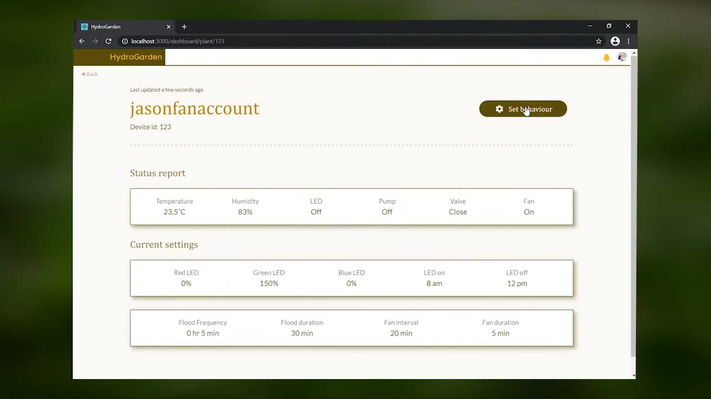

# IoT-Hydroponics
The project aims to provide an IoT automated system for hydroponics plant growth using the “ebb and flow” method. It utilizes Raspberry Pi as an edge device with actuators and sensors, and leverages AWS hosted serverless web app as a frontend interface for remote user monitoring and control.

Demo: https://youtu.be/IKrSYXYS4Ik

Not fully implemented:

1. STM32 ARM based device as edge device
2. Camera

## Diagrams
### Chassis design

### Implemented AWS services

### Edge device connections

### State diagrams
#### Edge main program

#### User authentication

### Business class diagram

### New edge configuration activity diagram

## Web application screenshots
### Landing page

### User register

### User login

### Dashboard

### Edge device status

### Edge device configuration

